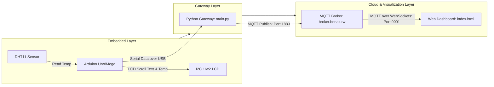

# IoT Temperature Monitor & Display Dashboard

An end-to-end IoT and Embedded Systems application that reads real-time temperature data from a **DHT11 sensor**, displays it on an **I2C 16x2 LCD Screen** alongside a scrolling candidate name, transmits the data via **Serial communication** to a host machine, forwards it to an **MQTT Broker** using a **Python Gateway**, and visualizes it on a live **Web Dashboard**.

Created by **ISHIMWE AMANI SAMUEL**.

---

## 🏗️ Architecture & Workflow

The system operates across three main layers:



1. **Embedded Layer (Arduino):** 
   - Reads ambient temperature using the **DHT11 sensor**.
   - Scrolls the student's name (`ISHIMWE AMANI SAMUEL`) on the first row of the **I2C 16x2 LCD**.
   - Displays the temperature on the second row of the LCD.
   - Sends the temperature reading as a float value to the computer's Serial port at `9600` baud.
   
2. **Gateway Layer (Python):**
   - The Python script (`main.py`) continuously listens to the specified Serial port (e.g., `COM6`).
   - Parses the temperature value and prints it locally.
   - Publishes the temperature data to a public MQTT broker under the topic: `rwanda/arduino/dht11/temperature`.

3. **Cloud & Web Visualization Layer (HTML/CSS/JS):**
   - The webpage (`index.html`) connects directly to the MQTT broker using WebSockets (`ws://broker.benax.rw:9001`).
   - Subscribes to the topic `rwanda/arduino/dht11/temperature`.
   - Updates the user interface dynamically in real-time.

---

## 📁 Project Structure

*   **[temperature.ino](file:///d:/Embedded-Practical/temperature.ino)** - Arduino C++ source code for sensor reading, LCD scrolling logic, and Serial writing.
*   **[main.py](file:///d:/Embedded-Practical/main.py)** - Python gateway script bridging Serial data (Arduino) to MQTT (Cloud).
*   **[index.html](file:///d:/Embedded-Practical/index.html)** - Dashboard frontend that subscribes to the MQTT WebSockets channel and renders the live temperature.
*   **[style.css](file:///d:/Embedded-Practical/style.css)** - Dark-mode retro design styles for the web dashboard.

---

## 🛠️ Hardware Requirements & Wiring

### Components
1. Arduino Uno, Mega, or compatible microcontroller.
2. DHT11 Temperature & Humidity Sensor.
3. 16x2 LCD display equipped with an I2C interface module (PCF8574).
4. Breadboard and Jumper wires.

### Pin Connections
*   **DHT11 Sensor**:
    *   `VCC` ➡️ `5V`
    *   `GND` ➡️ `GND`
    *   `DATA` ➡️ Digital Pin `7`
*   **I2C LCD Display**:
    *   `VCC` ➡️ `5V`
    *   `GND` ➡️ `GND`
    *   `SDA` ➡️ `A4` (or dedicated SDA pin on Uno/Mega)
    *   `SCL` ➡️ `A5` (or dedicated SCL pin on Uno/Mega)

---

## 🚀 Getting Started

### 1. Arduino Firmware Setup
1. Open the [temperature.ino](file:///d:/Embedded-Practical/temperature.ino) file in the **Arduino IDE**.
2. Install the necessary libraries via the Library Manager:
   - `LiquidCrystal I2C` by Frank de Brabander
   - `DHT sensor library` by Adafruit
   - `Adafruit Unified Sensor` by Adafruit
3. Connect your Arduino to your computer via USB.
4. Select the correct **Board** and **Port** in the Arduino IDE.
5. Upload the code to the board.

### 2. Python Gateway Setup
1. Ensure **Python 3.x** is installed on your computer.
2. Open a terminal/command prompt and install the dependencies:
   ```bash
   pip install pyserial paho-mqtt
   ```
3. Open [main.py](file:///d:/Embedded-Practical/main.py) and confirm or modify the `SERIAL_PORT` variable to match the COM port assigned to your Arduino (e.g. `"COM6"` on Windows or `"/dev/ttyUSB0"` on Linux/macOS).
4. Run the Python Gateway script:
   ```bash
   python main.py
   ```
   *You should see output indicating successful connection and printouts of temperature data as it arrives.*

### 3. Web Dashboard Setup
1. Simply double-click [index.html](file:///d:/Embedded-Practical/index.html) to open it in any modern web browser.
2. The dashboard will automatically connect to the MQTT broker over WebSockets and start displaying live temperature updates whenever the Python script publishes a new value.


http://157.173.101.159:8058/